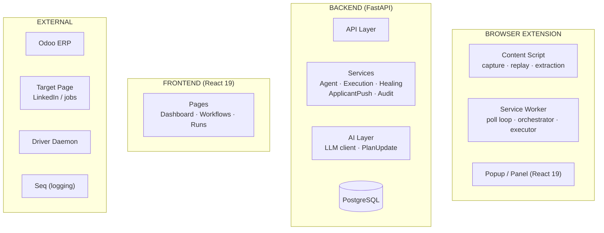
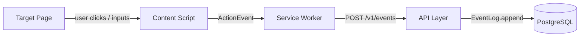
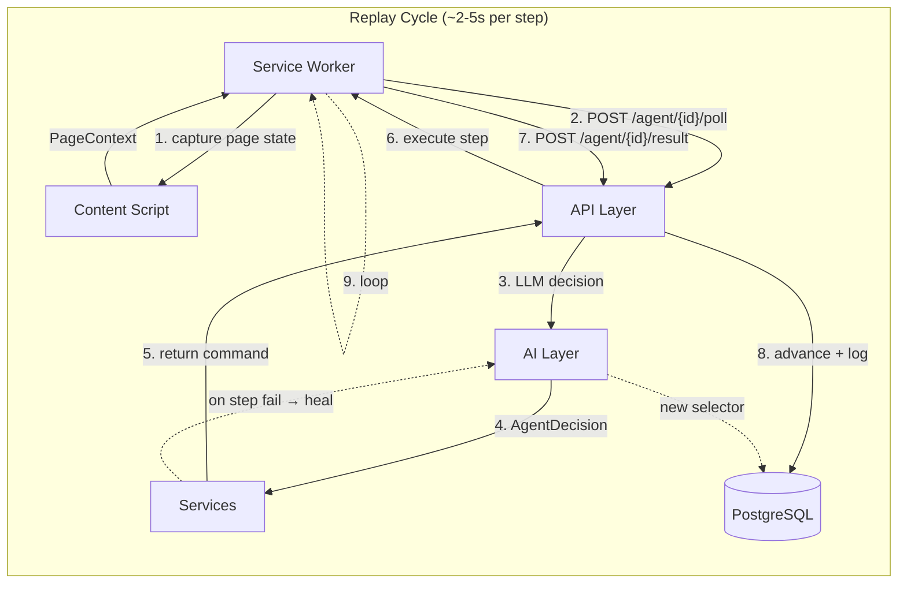
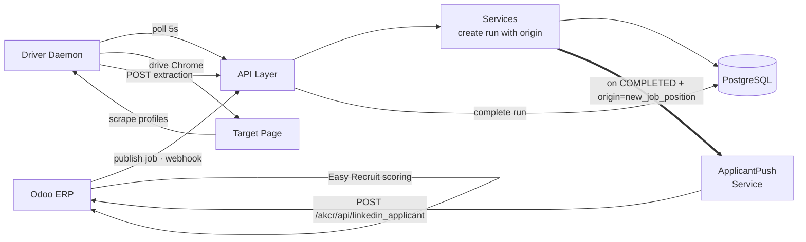

# System Architecture — Data Flows

> A flow-oriented view of the session-replay system. Components are organized by layer; numbered paths show how data moves between them during each operation mode.

## 1. System Layers



## 2. Recording



## 3. Replay (AI Poll Loop)



## 4. Recruitment Automation



## Flow Paths Summary

| # | Path | Trigger | Duration | Key Components |
|---|---|---|---|---|---|
| ❶ | **Recording** | User action on page | Real-time | Content Script → Service Worker → API → EventLog → DB |
| ❷ | **Replay** | "Run" clicked | ~2-5s/step | SW → API → AI → Service → SW → CDP/CS → PAGE → API → DB |
| ❸ | **Recruitment Automation** | Odoo publish webhook | 4-18 min | ODOO → API → DB → DAEMON → CHROME → scrape → LAPS → ODOO |
| — | **Healing** (sub-flow of ❷) | Step fails | 3-10s | Service → AI → new selector → DB → re-execute |
| — | **Recovery Supervisor** (sub-flow of ❷) | Run stale >240s | 30s cycle | background task → AI → Service → resume run |
| — | **Logging** (cross-cutting) | Any event | Continuous | All layers → Seq |

## State Machine

```
          ┌────────────────────────────────────────────┐
          │                                            │
          ▼                                            │
     ┌─────────┐     ┌──────────┐     ┌────────┐     │
     │  IDLE   │────▶│RECORDING │────▶│VALIDATED│     │
     └────┬────┘     └──────────┘     └───┬────┘     │
          │                               │          │
          │             ┌─────────────────┘          │
          │             ▼                            │
          │       ┌──────────┐                       │
          └──────▶│  QUEUED  │                       │
                  └────┬─────┘                       │
                       ▼                             │
                  ┌──────────┐                       │
                  │ RUNNING  │───────────────────────┘
                  └────┬─────┘
                       │
          ┌────────────┼─────────────────┐
          ▼            ▼                 ▼
   ┌────────────────┐ ┌──────────┐ ┌──────────┐
   │WAITING_FOR_USER│ │RECOVERING│ │ COMPLETED │
   └───────┬────────┘ └─────┬────┘ │   (✓)    │
           │                │      └──────────┘
           └──────┬─────────┘      ┌──────────┐
                  ▼                │  FAILED  │
             ┌──────────┐         │   (✗)    │
             │ RUNNING  │         └──────────┘
             │ (resume) │         ┌──────────┐
             └──────────┘         │ CANCELED │
                                  │   (⊘)    │
                                  └──────────┘

WAITING_FOR_USER → RUNNING (human clicks Continue)
WAITING_FOR_USER → RECOVERING (AI auto-recovery)
RECOVERING → RUNNING (recovery succeeded)
RECOVERING → WAITING_FOR_USER (recovery needs human)
RECOVERING → FAILED (recovery exhausted)
```

## Autonomy Stack

| Phase | Layer | Mechanism | Triggers |
|---|---|---|---|
| L0 | Deterministic | Fast-path EXECUTE (no AI key) | `AI_API_KEY` not set |
| L1 | AI-First Poll | LLM consulted every poll | `AI_API_KEY` set (default) |
| L2 | Goal-First Cursor | `goal_progress` phases + intents | Run created with analysis |
| L3 | PlanUpdate Ops | INSERT/REMOVE/MODIFY/REORDER/SIMPLIFY steps | AI decides to adapt mid-run |
| L4 | Recovery Supervisor | 30s background poll, 5-cap auto-resume | Run stale >240s |
| L5 | Telemetry + Learning | `AIDecisionOutcome` + EMA stability scores | Per poll (telemetry) / terminal state (learning) |
| L6 | Tool-Use AI | OpenAI tool calling with inner loop | `execution_mode = "agent"` |

## Key Integration Points

| Integration | Direction | Protocol | Notes |
|---|---|---|---|
| Extension → Backend | Poll/Result | HTTPS + JSON + X-API-Key | Poll every 2-5s during replay |
| Frontend → Backend | REST | HTTPS + JSON + X-API-Key | Vite dev proxy → /v1 |
| Odoo → Backend | Webhook | POST JSON | `new_job_position` event kind |
| Backend → Odoo | Push | POST JSON + X-API-Key | 240s timeout (sync scoring) |
| Extension → Seq | Logging | POST /v1/debug/log | No API key needed |
| Extension ↔ Content | Internal | chrome.runtime.sendMessage | Same-origin message passing |
| Extension ↔ Dashboard | Cross-origin | window.postMessage | Origin-checked |
| Driver Daemon ↔ Backend | REST | HTTPS + JSON + X-API-Key | Polls every 5s |
| Driver Daemon → Chrome | CDP/Playwright | DevTools Protocol | Stealth profile with cookies |
